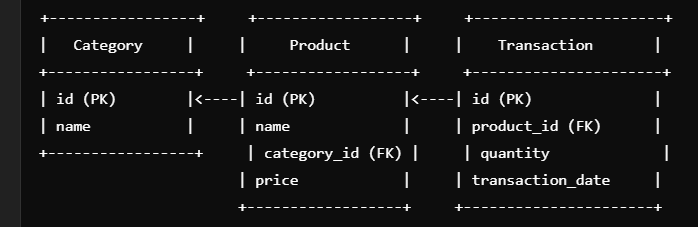
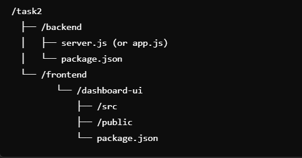

---

# Task 1: Java Process To Import Transactions in MySQL Table

## Schema Overview

The project consists of three main entities: **Category**, **Product**, and **Transaction**. Below is the schema representation:

### Tables and Relationships:

1. **Category Table**: Stores information about product categories.
2. **Product Table**: Contains details about products, each associated with a category.
3. **Transaction Table**: Records transactions made for products, including the quantity and date.

### Entity-Relationship Diagram

Here is the visual schema for the project:



### SQL Schema

```sql
-- Category Table
CREATE TABLE IF NOT EXISTS Category (
    id INTEGER PRIMARY KEY AUTOINCREMENT,
    name VARCHAR(255) NOT NULL UNIQUE
);

-- Product Table
CREATE TABLE IF NOT EXISTS Product (
    id INTEGER PRIMARY KEY AUTOINCREMENT,
    name VARCHAR(255) NOT NULL UNIQUE,
    category_id INTEGER,
    price REAL,
    FOREIGN KEY (category_id) REFERENCES Category(id)
);

-- Transaction Table
CREATE TABLE IF NOT EXISTS Transactions (
    id INTEGER PRIMARY KEY AUTOINCREMENT,
    product_id INTEGER,
    quantity INTEGER,
    transaction_date DATE,
    FOREIGN KEY (product_id) REFERENCES Product(id)
);
```

### Running the Project

1. **Compile the Java Program**:
    - Open a terminal or command prompt.
    - Navigate to the directory where `Main.java` is located.
    - Run the following command to compile the Java file:
   ```bash
   javac Main.java
   ```

2. **Run the Java Program**:
    - After compiling, run the following command to execute the program:
   ```bash
   java Main
   ```

### Note:
Make sure that you have a MySQL database running and have created the necessary database and tables as described in the schema above before running the Java program.

---

# Task 2: Frontend for Database Tables

## Project Structure

This project is organized into two main parts:

1. **Backend**: Handles server logic and database operations.
2. **Frontend**: Provides the user interface to interact with the backend and display data.

### Project Structure

```bash
/task2
  ├── /backend
  │   ├── server.js (or app.js)
  │   └── package.json
  └── /frontend
      ├── /src
      └── /public
      └── package.json
```

- **Backend**:
    - **`server.js`** or **`app.js`**: Contains the server-side logic, including routing and database connections.
    - **`package.json`**: Lists all the dependencies required for the backend.

- **Frontend**:
    - **`/src`**: Contains the source code for the frontend, including components and API calls.
    - **`/public`**: Contains static files such as images, icons, and HTML.
    - **`package.json`**: Lists the dependencies required for the frontend.

### Backend Overview

The backend handles the logic of interacting with the database and provides an API to fetch and manipulate data for the frontend.

- **Backend Endpoints**:
    - **GET /categories**: Fetches a list of categories.
    - **GET /products**: Fetches a list of products.
    - **POST /transactions**: Allows users to create new transactions.

### Frontend Overview

The frontend is built using React.js and interacts with the backend through API calls.

- **Frontend Features**:
    - Displays the list of categories and products.
    - Allows users to create transactions by selecting a product and specifying a quantity.

### Running the Project

#### Backend Setup:

1. **Install Dependencies**:
    - Navigate to the **`/backend`** directory:
   ```bash
   cd task2/backend
   ```
    - Install dependencies using npm:
   ```bash
   npm install
   ```

2. **Start the Backend Server**:
    - Run the following command to start the backend server:
   ```bash
   node server.js
   ```

   The backend will be available at [http://localhost:3000](http://localhost:5000) (or another port if configured differently).

#### Frontend Setup:

1. **Install Dependencies**:
    - Navigate to the **`/frontend`** directory:
   ```bash
   cd task2/frontend/dashboard-ui
   
   ```
    - Install dependencies using npm:
   ```bash
   npm install
   ```

2. **Start the Frontend Server**:
    - Run the following command to start the frontend development server:
   ```bash
   npm start
   ```

   The frontend will be available at [http://localhost:3000](http://localhost:3000).

### ER Diagram

Here is the **Entity-Relationship Diagram** (ERD) for the project's schema:



---

### Dependencies

#### Backend Dependencies:
- **Express**: Web framework for Node.js to handle HTTP requests.
- **MySQL2**: MySQL database client for Node.js to interact with MySQL databases.

#### Frontend Dependencies:
- **React**: JavaScript library for building user interfaces.
- **Axios**: Promise-based HTTP client for making requests from the frontend to the backend.

---

### Future Improvements

- Add **user authentication** for the frontend.
- Implement **pagination** for categories and products.
- Improve **UI/UX** to make the interface more user-friendly.

---

Make sure the **backend** is running before starting the **frontend** to ensure the application works properly.